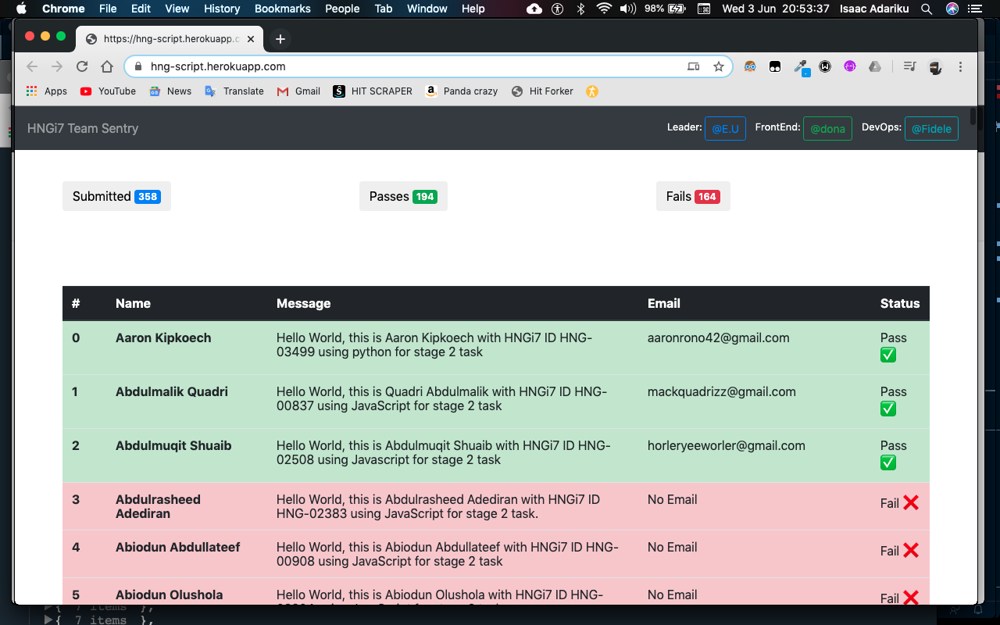
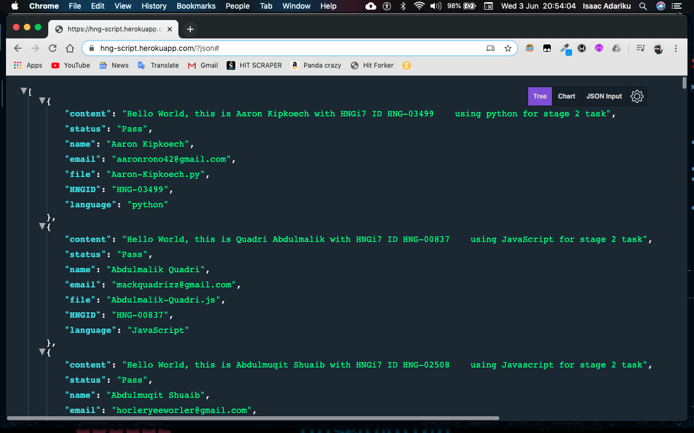

# HNG-SCRIPT:

This script gets all the files in the scripts folder and runs exec on it.

## Supported Languages

**Javascript | PHP | Python | Java | Dart**

## TO-RUN:

```yaml
Clone Repo:
  https://github.com/elishaukpong/HNG-Script.git
```
**Next**
```yaml
Add your intern script to the folder:
  /scripts

Following this format:
  [surname]-[name].[ext]

Example: ada-musa.js, ade_chika.py
```


**DON'T ADD YOUR SCRIPT TO THE ROOT DIRECTORY OF THIS PROJECT**
```yaml
Run:
  php -S localhost:8000 in the HNG-Script folder

Visit the link in the browser that look like:
  http://127.0.0.1:8080/
```

## NOTE:

Dart programmers must have dart install on the local machine for testing.

visit https://dart.dev/get-dart to install dart on your local machine.

PHP must be of version 7.3 and above

# RESULT:

This will show a list of all executed scripts and the status.

**Demo Image**
<p align="center">

</p>

## To get a JSON VERSION

```yaml
Add:
  /?json
  
To the end of:
  localhost:8000
  
Example: localhost:8000/?json
```

**Demo Json**
<p align="center">

</p>
